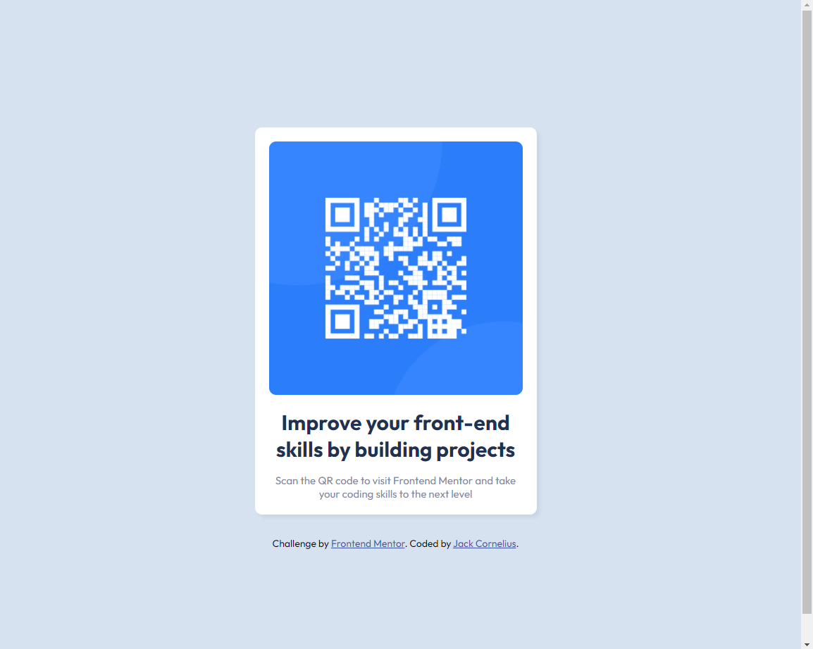

# Frontend Mentor - QR code component solution

This is a solution to the [QR code component challenge on Frontend Mentor](https://www.frontendmentor.io/challenges/qr-code-component-iux_sIO_H). Frontend Mentor challenges help you improve your coding skills by building realistic projects. 

## Table of contents

- [Overview](#overview)
  - [Screenshot](#screenshot)
  - [Links](#links)
- [My process](#my-process)
  - [Built with](#built-with)
  - [What I learned](#what-i-learned)

**Note: Delete this note and update the table of contents based on what sections you keep.**

## Overview

First Frontend Mentor challenge and attempt while following guides on YouTube for the same solution.

### Screenshot

### Links

- Solution URL: [Add solution URL here](https://distracted-mccarthy-8d81f7.netlify.app/)

## My process

Following YouTube guide for this particular challenge and review code while progresisng to understand the implementation.

### Built with

- HTML
- CSS

### What I learned

CSS classes & variables is something i've not used before.
Most of the basic HTML & CSS I have used in a basic form before.